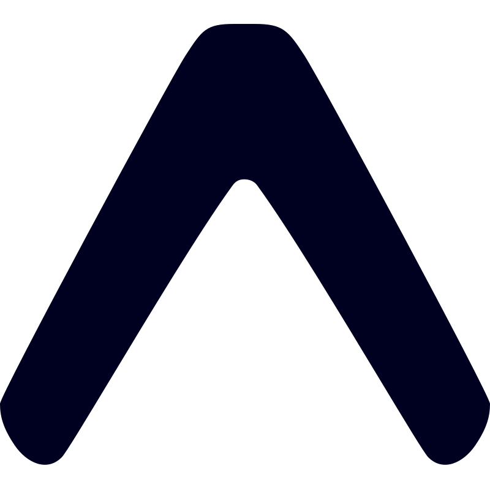

## Hey there

My name is **Arbob Mehmood** _(Pronounced: /Ar-Bob’/)_. Some things about me:

- 🔥 9+ years of experience building products and managing teams.
- 💖 Full-stack dev with a passion to build software that can help people achieve their goals efficiently.
- 📚 Avid problem solver and superfast learner. 
- 🥇 Obsessed with detail and customer centric approach to building software. 
- ⛳ Supernatural ability to break complex problems into small, easily-executable pieces. 
- 🏹 Love simplicity over anything. 
- 🚀 Always looking forward to helping and collaborate with young students and entrepreneurs having crazy ideas to change the world.

**I post my thoughts, opinions and ideas here:** 🌐 [www.arbob.me](https://www.arbob.me)

### Contact:

- 📧 Email: [hi@arbob.me](mailto:hi@arbob.me)
- 🤝 [Schedule a meeting](https://www.calendly.com/arbob)

### Technologies I Use

<a href="https://developer.mozilla.org/en-US/docs/Web/HTML" target="_blank">&nbsp;HTML5</a>&nbsp;&nbsp;
<a href="https://developer.mozilla.org/en-US/docs/Web/CSS" target="_blank">&nbsp;CSS3</a>&nbsp;&nbsp;
<a href="https://developer.mozilla.org/en-US/docs/Web/JavaScript" target="_blank">&nbsp;JavaScript</a>&nbsp;&nbsp;
<a href="https://www.typescriptlang.org/" target="_blank">&nbsp;TypeScript</a>&nbsp;&nbsp;
<a href="https://reactjs.org/" target="_blank">&nbsp;React</a>&nbsp;&nbsp;
<a href="https://react-redux.js.org/" target="_blank">&nbsp;Redux</a>&nbsp;&nbsp;
<a href="https://hookstate.js.org/" target="_blank">&nbsp;Hookstate</a>&nbsp;&nbsp;
<a href="https://nextjs.org/" target="_blank">&nbsp;Next.js</a>&nbsp;&nbsp;
<a href="https://sass-lang.com/" target="_blank">&nbsp;Sass</a>&nbsp;&nbsp;
<a href="https://getbootstrap.com/" target="_blank">&nbsp;Bootstrap</a>&nbsp;&nbsp;
<a href="https://tailwindcss.com/" target="_blank">&nbsp;Tailwind</a>&nbsp;&nbsp;
<a href="https://jestjs.io/" target="_blank">&nbsp;Jest</a>&nbsp;&nbsp;
<a href="https://ui.shadcn.com/" target="_blank">&nbsp;shadcn/ui</a>&nbsp;&nbsp;
<a href="https://material-ui.com/" target="_blank">&nbsp;MUI</a>&nbsp;&nbsp;
<a href="https://webpack.js.org/" target="_blank">&nbsp;Webpack</a>&nbsp;&nbsp;
<a href="https://vitejs.dev/" target="_blank">&nbsp;Vite</a>&nbsp;&nbsp;
<a href="https://tanstack.com/" target="_blank">&nbsp;TanStack</a>&nbsp;&nbsp;
<a href="https://nodejs.org/" target="_blank">&nbsp;Node.js</a>&nbsp;&nbsp;
<a href="https://www.npmjs.com/" target="_blank">&nbsp;NPM</a>&nbsp;&nbsp;
<a href="https://expressjs.com/" target="_blank">&nbsp;Express</a>&nbsp;&nbsp;
<a href="https://www.python.org/" target="_blank">&nbsp;Python</a>&nbsp;&nbsp;
<a href="https://www.djangoproject.com/" target="_blank">&nbsp;Django</a>&nbsp;&nbsp;
<a href="https://fastapi.tiangolo.com/" target="_blank">&nbsp;FastAPI</a>&nbsp;&nbsp;
<a href="https://www.mongodb.com/" target="_blank">&nbsp;MongoDB</a>&nbsp;&nbsp;
<a href="https://www.mysql.com/" target="_blank">&nbsp;MySQL</a>&nbsp;&nbsp;
<a href="https://www.postgresql.org/" target="_blank">&nbsp;PostgreSQL</a>&nbsp;&nbsp;
<a href="https://www.prisma.io/" target="_blank">&nbsp;Prisma</a>&nbsp;&nbsp;
<a href="https://redis.io/" target="_blank">&nbsp;Redis</a>&nbsp;&nbsp;
<a href="https://graphql.org/" target="_blank">&nbsp;GraphQL</a>&nbsp;&nbsp;
<a href="https://supabase.com/" target="_blank">&nbsp;Supabase</a>&nbsp;&nbsp;
<a href="https://reactnative.dev/" target="_blank">&nbsp;React Native</a>&nbsp;&nbsp;
<a href="https://expo.dev/" target="_blank">&nbsp;Expo</a>&nbsp;&nbsp;
<a href="https://git-scm.com/" target="_blank">&nbsp;Git</a>&nbsp;&nbsp;
<a href="https://github.com/features/actions" target="_blank">&nbsp;CI/CD</a>&nbsp;&nbsp;
<a href="https://www.docker.com/" target="_blank">&nbsp;Docker</a>&nbsp;&nbsp;
<a href="https://www.terraform.io/" target="_blank">&nbsp;Terraform</a>&nbsp;&nbsp;
<a href="https://aws.amazon.com/" target="_blank">&nbsp;AWS</a>&nbsp;&nbsp;
<a href="https://cloud.google.com/" target="_blank">&nbsp;GCP</a>&nbsp;&nbsp;
<a href="https://azure.microsoft.com/" target="_blank">&nbsp;Azure</a>&nbsp;&nbsp;
<a href="https://www.heroku.com/" target="_blank">&nbsp;Heroku</a>&nbsp;&nbsp;
<a href="https://firebase.google.com/" target="_blank">&nbsp;Firebase</a>&nbsp;&nbsp;
<a href="https://www.nginx.com/" target="_blank">&nbsp;Nginx</a>&nbsp;&nbsp;
<a href="https://www.rabbitmq.com/" target="_blank">&nbsp;RabbitMQ</a>&nbsp;&nbsp;
<a href="https://kafka.apache.org/" target="_blank">&nbsp;Kafka</a>&nbsp;&nbsp;
<a href="https://www.serverless.com/" target="_blank">&nbsp;Serverless</a>&nbsp;&nbsp;
<a href="https://www.postman.com/" target="_blank">&nbsp;Postman</a>&nbsp;&nbsp;
<a href="https://openai.com/" target="_blank">&nbsp;OpenAI</a>&nbsp;&nbsp;
<a href="https://www.anthropic.com/" target="_blank">&nbsp;Claude</a>&nbsp;&nbsp;
<a href="https://www.langchain.com/" target="_blank">&nbsp;LangChain</a>&nbsp;&nbsp;
<a href="https://ai.google.dev/gemini-api" target="_blank">&nbsp;Gemini</a>&nbsp;&nbsp;
<a href="https://llama.meta.com/" target="_blank">&nbsp;Llama</a>&nbsp;&nbsp;
<a href="https://code.visualstudio.com/" target="_blank">&nbsp;VS Code</a>&nbsp;&nbsp;
<a href="https://wordpress.org/" target="_blank">&nbsp;WordPress</a>&nbsp;&nbsp;
<a href="https://www.adobe.com/products/photoshop.html" target="_blank">&nbsp;Photoshop</a>&nbsp;&nbsp;
<a href="https://www.figma.com/" target="_blank">&nbsp;Figma</a>&nbsp;&nbsp;
<a href="https://brave.com/" target="_blank">&nbsp;Brave</a>&nbsp;&nbsp;
<a href="https://ubuntu.com/" target="_blank">&nbsp;Ubuntu</a>

